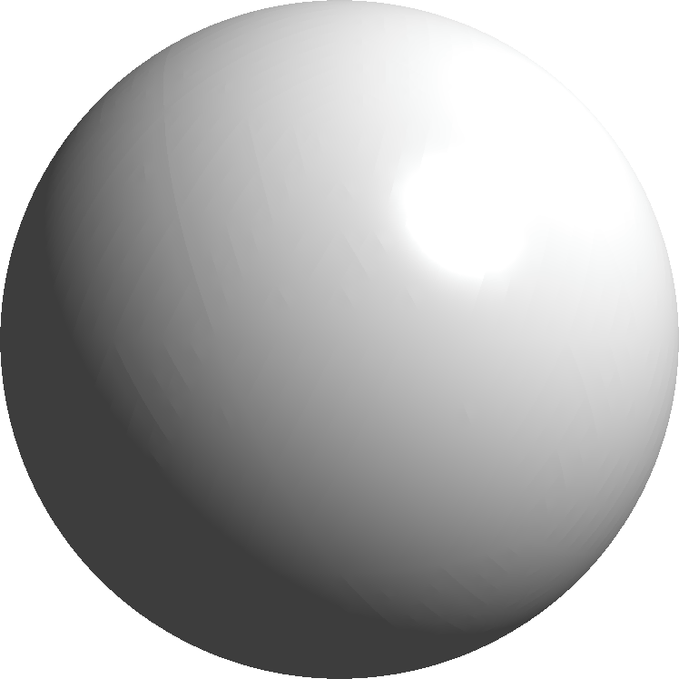
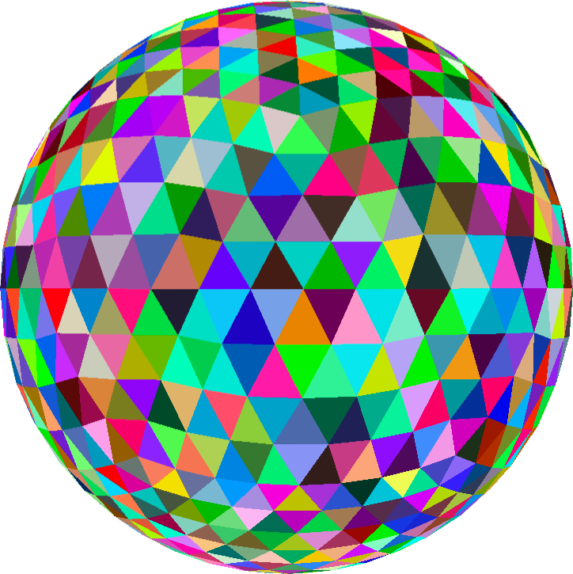

<h1 align="center">
   
  
  
</h1>

Building a performant, constraint-based physics engine from scratch in C with OpenGL, GLFW, and cglm.
- Traverse through the scene with keyboard and cursor controls
- Allow users to save and load previous configurations
- Model and render cubes, spheres, and equilateral tetrahedrons with programatically generated meshes
- Use instancing to handle rendering identical meshes
- Add Phong lighting to rendered objects
- Add shadows to rendered objects
- **[in progress]** Add text to rendered output describing performance metrics
- **[in progress]** Add UI to adjust simulation configurations while running
- **[in progress]** Implement a constraint-based physics solver
- **[in progress]** Add skybox for easier viewing and simulation traversal
- **[in progress]** Handle millions of concurrent objects through compute shaders
